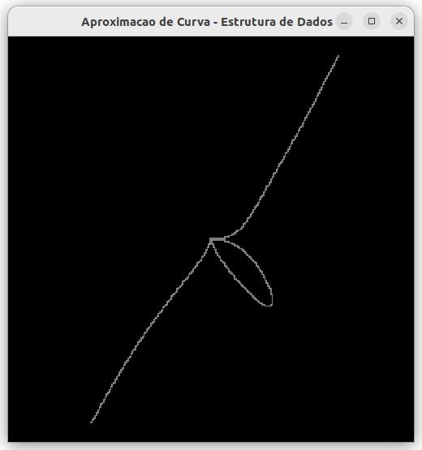
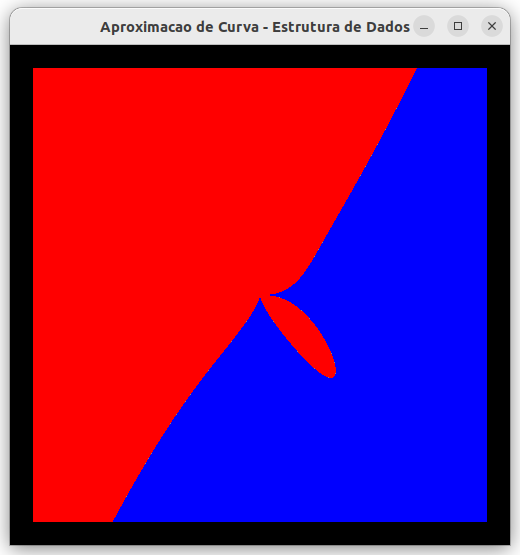
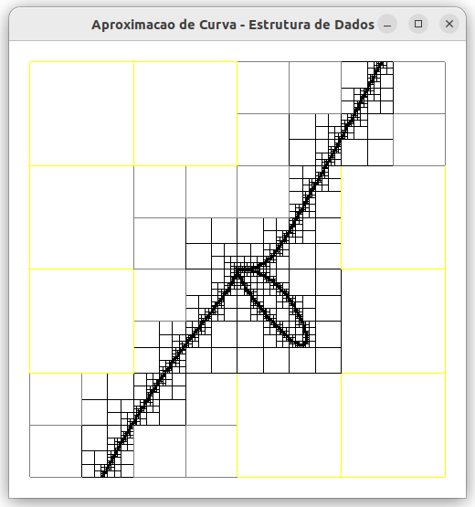
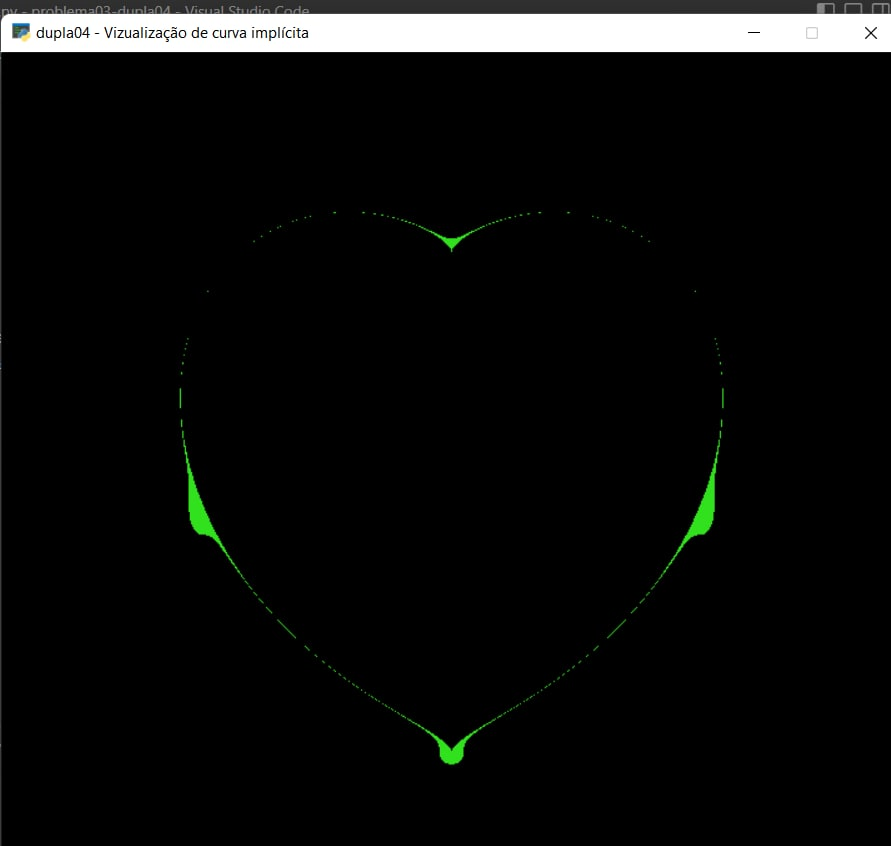
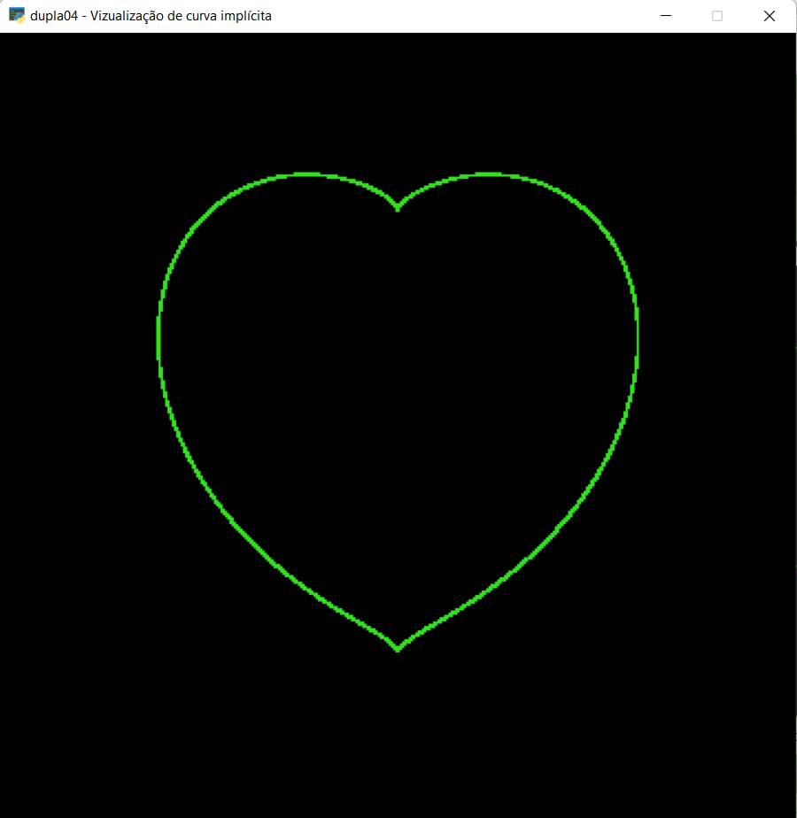

# Problema 3 - Visualização de Objetos Implícitos

## Introdução:
O presente trabalho visa a resolução do problema proposto acerca da representação de figuras geómetricas de funções implícitas. Foi solicitado o desenvolvimento de um programa em python que, através da biblioteca *Pyglet*, fosse possível representar curvas de determinadas funções implícitas, através do processo de **dividir-para-conquistar**. Nesse processo de divisão, a execução de busca subdivide o domínio da função, analisando cada sub-domínio em busca dos pontos que possam satisfazer a equação. 

**Observação:** Para facilitar a construção dessas equações, todo o desenvolvimento do projeto foi solicitado em domínio 2D.

Foram equisitadas 3 formas de visualização:

### 1- A curva aproximada da função (Modo 1):

*Figura 1 - Modo de visualização 1*

### 2- A divisão do espaço em regiões externas, internas e de fronteira da curva (Modo 2):

*Figura 2 - Modo de visualização 2*

### 3- A divisão de todos os níveis da estrutura da curva (Modo 3):

*Figura 3 - Modo de visualização 3*

Além disso, foi requerido que o usuário pudesse, de forma interativa, alterar entre as equações predefinidas pelo programador, como a resolução ou o nível de precisão da equação representada, e pudesse alternar entre as 3 formas de visualização.

## Escolha de algoritmos e estruturas:
Como o objetivo do trabalho é representar funções em um espaço bidimensional subdividido, a estrutura mais adequada é a *Quadtree*. Nesta estrutura de árvore, cada nó terá no máximo quatro filhos, sendo estes subdividos quando dois ou mais pontos são inseridos na mesma sub-árvore. Além disso, *Quadtrees* também facilitam a busca de nós em um espaço bidimensinal, isso sendo necessário para a busca das coordenadas que satisfazem determinada equação.
Com isto, duas classes foram projetadas.

### Boundary:
Esta classe funciona como um suporte para a classe principal, a **Quadtree**, basicamente, os boundary vão ser os quadrantes de cada subdivisão, estes armazenam as coordenadas do quadrante, além de verificarem através dessas coordenadas se existe alguma solução para a equação implcíta contida no quadrante.

### Quadtree:
Esta classe, que é a principal do programa, têm as características de uma quadtree qualquer, porém aplicadas e adaptadas exclusivamente para o uso na biblioteca *pyglet*. Alguns parâmetros serem explicados é de suma importância. A subdivisão das sub-árvores irão acontecer quando a mesma alcançar seu limite de carga máxima de um pixel, isto é, quando uma sub-árvore armazenar mais de um pixel pintado, que representam as soluções da função naquele intervalo. Além disso, por questões de visualização e de complexidade o limite máximo da quadtree (ou seja o número maximo de subdvisões) foi definido como sete. Ademais, as funções de cada modo de vizualização estão contidas nesta classe. 

## Implementação:
Para a resolução do problema de desenhar as curvas das equações implicitas, é necessário fazer a busca dos pontos que satisfazem essas equações. Para isto, foram estudados e testados alguns algoritmos que encontrassem essas coordenadas.

### Pixel como solução da equação:
O primeiro algoritmo implementado buscava os quadrantes do subnível mais interno que satisfaziam a equação, ou seja, o pixel que sua coordenada era uma solução para a função. Desde já, pode-se notar os erros que tal implementação trariam. O erro mais notável é sobre o domínio, pois a maioria das soluções são números reais e, em contrapartida, as coordenadas de cada pixel eram representadas como números racionais. Para solucionar esse problema, arredondamos o valor da função em cada pixel por algumas casas decimais, ou seja, os pixels que tivessem como solução um valor proximo de zero seria pintado, mas além de ser custoso, por ter que analisar cada pixel, a visualização da função também tinha erros, como por exemplo, um intervalo próximo da solução correta era pintado, desse modo "engrossando" a linha da função no intervalo. Ademais, alguns intervalos não apresentavam solução, deixando espaços vazios na curva. Esses problemas podem ser vistos na Figura 4.

*Figura 4 - Imagem de uma função proposta pela solução 1*

### Matriz dos vérticies do quadrante:
Nesta solução implementada, era verificado o sinal das soluções de cada vérticie dos quadrantes, criando uma matriz 2x2 e armazenando o valor 0 caso o resultado da equação fosse positivo e 1 caso contrário. Assim, quando uma matriz armazena dois valores diferentes, pelo teorema do valor médio, significa que existe uma solução para a função contida naquele quadrante. Quando isso acontece, um ponto é adicionado na sub-árvore daquele quadrante. Esta solução melhorou a visualização da curva da função, porém ainda é considerado custoso. 

*Figura 5 - Imagem de uma função proposta pela solução 2*

É notavél a melhora da precisão desta implementação.

## Simulação do programa:
Após executar o arquivo main.py, uma tela do pyglet será aberta e os seguintes passos devem ser feitos:

1 - Apertar espaço para montar a Quadtree e poder vizualizar a função;

2 - Para alterar o modo de vizualização as teclas númericas 1, 2 e 3 devem ser apertadas, sendo respectivamente para o modo de visuzalização 1, 2 e 3;

3 - Para alterar a resolução da curva o scroll do mouse deve ser rolado para frente ou para trás, aumentando ou diminuindo a resolução, respectivamente;

4 - Para alterar a função desejada é necessário alterar a variável equation, para uma das equações implícitas predefinadas: 

equation0: x² - y
    

equation1: sqrt{(x)} + sqrt{(y)} - 2

equation2: sen(x) - cos(y)

    
equation3: (x² + y² - 4)³ - x² * y²

equation4: x^7 -y^5 + x² * y³ - (x*y)²  

equation5: x³ + y² - 6*x*y  

## Referências: 

[1] TUPPER, J. **Reliable Two-Dimensional Graphing Methods for Mathematical Formulae with Two Free Variables**.

[2] SHAMSHAD, A. **Quadtree Algorithm for Implicit Curve Drawing**. Disponível em: http://shamshad-npti.github.io/implicit/curve/2015/10/08/Implicit-curve/.

[3] pyglet. **pyglet Documentation**. https://pyglet.readthedocs.io/en/latest/

[4] mattbatwings. **I Made a Multi-Line Renderer with just Redstone!**. Disponível em: https://www.youtube.com/watch?v=vfPGuUDuwmo. 
